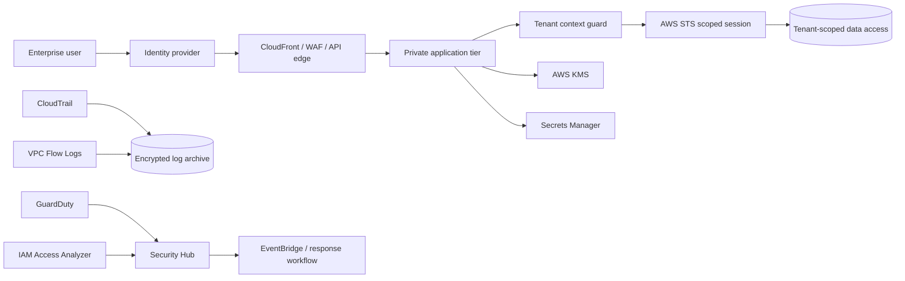

# SaaSSecOps

**AWS SaaS Security & Trust Reference Architecture**

SaaSSecOps is an open-source reference architecture and local assurance demo for reasoning about security in a multi-tenant SaaS environment on AWS. It connects tenant isolation, identity, network boundaries, encryption, audit logging, threat detection, security posture management and customer-trust evidence in one inspectable project.

> [!IMPORTANT]
> This repository is a **reference architecture and portfolio demonstration**. It does not prove that any AWS environment has been deployed, independently assessed, penetration tested, certified or approved for production. The included Terraform is an account-scoped reference baseline and must be reviewed, adapted and tested before any real deployment.

## Why this project exists

Security assurance for SaaS customers is rarely just one control. A credible security story has to connect architecture, tenant isolation, IAM, network boundaries, encryption, telemetry, detection, incident response and evidence that can be explained to technical and non-technical stakeholders.

SaaSSecOps models that connection explicitly and generates a deterministic assurance report from a declared architecture posture.

## Reference architecture



Production SaaS systems may use pooled, siloed or hybrid isolation depending on risk, tenancy model, regulatory obligations and product design.

## Included

- Tenant isolation posture with tenant-context propagation, scoped credentials and data-layer enforcement.
- AWS IAM posture: federation, least privilege, short-lived credentials and IAM Access Analyzer.
- VPC/private-tier posture and VPC Flow Logs.
- KMS/data-protection posture including TLS, encryption at rest and managed secrets.
- CloudTrail multi-Region logging and log-file validation.
- GuardDuty and Security Hub detective controls.
- Account-scoped Terraform reference for CloudTrail, KMS, S3 log archive, GuardDuty, Security Hub and Access Analyzer.
- Deterministic local assurance CLI producing `pass`, `gap` and `not_applicable` evidence.
- Threat model, control matrix and customer-trust playbook.

## Quickstart

```bash
PYTHONPATH=src python -m saassecops assess \
  examples/reference-architecture.json \
  --policy policies/aws-saas-controls.json \
  --output artifacts/reference-assessment.json
```

Risky example:

```bash
PYTHONPATH=src python -m saassecops assess \
  examples/risky-architecture.json \
  --policy policies/aws-saas-controls.json
```

Run tests:

```bash
PYTHONPATH=src python -m unittest discover -s tests -v
```

## Control families

| Family | Purpose |
| --- | --- |
| TENANT | Prevent cross-tenant access and preserve tenant context |
| IAM | Least privilege, federation and permission analysis |
| NET | Private workload and network telemetry controls |
| DATA | Encryption, TLS, secrets and key separation |
| LOG | Durable and integrity-aware audit telemetry |
| DET | Threat detection and security posture visibility |
| IR | Response ownership, escalation and tested playbooks |
| TRUST | Architecture and assurance evidence suitable for customer conversations |

## AWS guidance posture

The design is informed by the AWS Well-Architected SaaS Lens, especially its tenant-isolation guidance and the security areas of identity and access management, detective controls, infrastructure protection, data protection and incident response.

- AWS SaaS Lens: https://docs.aws.amazon.com/wellarchitected/latest/saas-lens/saas-lens.html
- Tenant isolation: https://docs.aws.amazon.com/wellarchitected/latest/saas-lens/tenant-isolation.html

A passing local assessment does not establish AWS Well-Architected conformance, SOC 2 compliance, ISO 27001 certification, regulatory compliance, production security or customer acceptance.

## Explicit non-claims

SaaSSecOps does **not** by itself establish effective deployed tenant isolation, correct AWS configuration, vulnerability absence, penetration-test success, production monitoring effectiveness, key-custody effectiveness, regulatory compliance or customer acceptance. The Terraform baseline has not been applied to any AWS account by this repository.

## Author

Bilge Kayalı

## License

Apache License 2.0.
