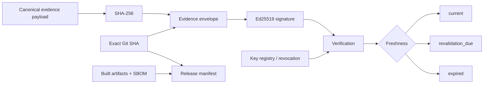

# SaaSSecOps

**AWS SaaS Security & Trust Reference Architecture**

SaaSSecOps is an open-source reference architecture and local assurance toolkit for multi-tenant SaaS security on AWS. It connects tenant isolation, application/API security, software supply-chain controls, customer-trust workflows and evidence integrity in one inspectable project.

> [!IMPORTANT]
> This repository is a **reference architecture and portfolio demonstration**. It does not prove that any AWS environment or SaaS application has been deployed, independently assessed, penetration tested, certified or approved for production.

Current package milestone: **v0.7.0 — Evidence Integrity & Automation**.

## Summary

v0.7 adds cryptographic and lifecycle controls around repository evidence. Evidence envelopes bind canonical payload digests to an exact source revision, Ed25519 signing-key identity and explicit freshness windows. CI verifies signatures, rejects revoked keys and tampering, generates source-bound release manifests and packages SBOM/release evidence for review.

## Evidence integrity flow



## Included

- AWS multi-account security/logging reference with delegated administration.
- Pool, silo and bridge tenant-isolation contracts and negative cross-tenant tests.
- OWASP Top 10:2025 and OWASP API Security Top 10:2023 risk mappings.
- CodeQL, dependency audit and CycloneDX 1.7 SBOM gates.
- Vulnerability finding and time-bounded exception evidence.
- Evidence-bound security-questionnaire and Security GTM control model.
- Customer-facing assurance pack and trust-exception register.
- Ed25519 signed evidence-envelope contract.
- Public signing-key registry with active/retired/revoked lifecycle states.
- Fail-closed tamper and revoked-key verification tests.
- `current`, `revalidation_due` and `expired` evidence decisions.
- Exact-source release manifest with SHA-256 checksums for distribution artifacts and SBOM.
- CI release-evidence bundle and tag-triggered build-provenance workflow.
- Python 3.11–3.13, Terraform, CodeQL and repository contract gates.

## Quickstart

```bash
python -m pip install -e .
```

Validate key lifecycle metadata:

```bash
saassecops validate examples/key-registry.json --kind key-registry
```

Run signature, tamper, revocation and freshness gates:

```bash
python scripts/run_evidence_integrity.py
saassecops validate artifacts/evidence-envelope.json --kind evidence-envelope
```

Build a source-bound release manifest after package/SBOM generation:

```bash
python -m build
python scripts/generate_sbom.py --output artifacts/saassecops.cdx.json
python scripts/generate_release_manifest.py \
  --version 0.7.0 \
  --source-sha <40-character-git-sha> \
  --artifact-dir dist \
  --sbom artifacts/saassecops.cdx.json \
  --output artifacts/release-manifest.json
```

See [Evidence Integrity](docs/EVIDENCE_INTEGRITY.md) and [Evidence Signing Key Lifecycle](docs/KEY_LIFECYCLE.md).

## Key-management boundary

No production private signing key is committed to this repository. CI derives a deterministic **synthetic test-only** Ed25519 seed in memory so verification is reproducible. Real private keys belong in an approved external signing boundary such as an HSM, KMS or protected signing service with independent access, rotation and revocation controls.

## Release direction

The path to v1.0 is evidence-gated rather than date-gated. Release criteria are maintained in [ROADMAP.md](ROADMAP.md), with compatibility expectations in [COMPATIBILITY.md](COMPATIBILITY.md).

## Explicit non-claims

SaaSSecOps does **not** establish deployed security effectiveness, production key custody, vulnerability absence, penetration-test success, certification, regulatory compliance, contractual acceptance or customer approval. Cryptographic verification proves only that the signed reference envelope has not changed under the modeled key lifecycle; it does not prove the truth or operational effectiveness of the underlying security claim.

## Author

Bilge Kayalı

## License

Apache License 2.0.
