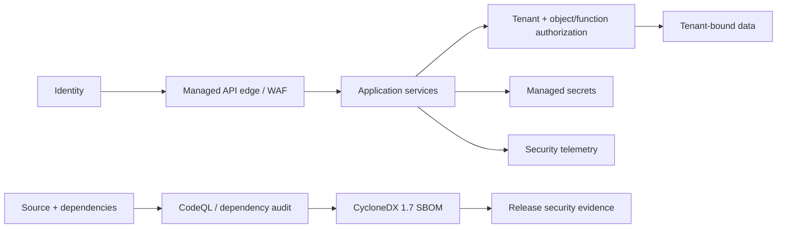

# SaaSSecOps

**AWS SaaS Security & Trust Reference Architecture**

SaaSSecOps is an open-source reference architecture and local assurance toolkit for reasoning about security in a multi-tenant SaaS environment on AWS. It connects tenant isolation, identity, application/API security, software supply-chain evidence, network boundaries, encryption, audit logging, threat detection and customer-trust evidence in one inspectable project.

> [!IMPORTANT]
> This repository is a **reference architecture and portfolio demonstration**. It does not prove that any AWS environment or SaaS application has been deployed, independently assessed, penetration tested, certified or approved for production. Reference controls must be reviewed, adapted and tested before real deployment.

Current package milestone: **v0.5.0 — Application & API Security**.

## Summary

SaaSSecOps models a SaaS security assurance story through machine-readable contracts, deterministic evidence, multi-account security boundaries, explicit tenant isolation and application/API security gates.

## Security architecture



The multi-account model separates Security Tooling and Log Archive accounts from workloads. The tenant-isolation reference represents pool, silo and bridge patterns with fail-closed negative vectors. v0.5 adds OWASP-aligned web/API controls and supply-chain gates. See [Application and API Security](docs/APPLICATION_API_SECURITY.md).

## Included

- AWS multi-account security/logging reference with delegated security administration.
- Pool, silo and bridge tenant-isolation contracts and negative cross-tenant tests.
- AWS STS/ABAC pooled authorization reference using `tenant-id`.
- OWASP Top 10:2025 and OWASP API Security Top 10:2023 risk mappings.
- Secure-SDLC evidence requirements for threat modeling, review, testing and finding disposition.
- API edge/WAF/TLS/rate-limit/schema-validation/authorization reference controls.
- Managed-secret and least-privilege secret-access requirements.
- CodeQL code-scanning workflow and dependency vulnerability audit.
- CycloneDX 1.7 SBOM generation and structural verification.
- Vulnerability evidence contract with accountable ownership and time-bounded risk acceptance.
- Strict JSON Schema contracts for the public reference surfaces.
- Deterministic assessment identity and SHA-256 evidence bindings.
- Terraform validation for account and organization reference baselines.
- Threat models, control matrix, customer-trust playbook and versioned v1 roadmap.

## Quickstart

Install locally:

```bash
python -m pip install -e .
```

Validate reference contracts:

```bash
saassecops validate architecture/multi-account-reference.json --kind multi-account
saassecops validate architecture/tenant-isolation-reference.json --kind tenant-isolation
saassecops validate architecture/appsec-reference.json --kind appsec
saassecops validate examples/vulnerability-evidence.json --kind vulnerability-evidence
```

Run tenant isolation tests and generate an SBOM:

```bash
python scripts/run_isolation_vectors.py
python scripts/generate_sbom.py --output artifacts/saassecops.cdx.json
python scripts/verify_sbom.py artifacts/saassecops.cdx.json
```

Generate a reference assessment and exact-byte evidence manifest:

```bash
saassecops assess examples/reference-architecture.json --policy policies/aws-saas-controls.json --output artifacts/reference-assessment.json --manifest-output artifacts/reference-manifest.json
```

Run tests:

```bash
python -m unittest discover -s tests -v
```

## Release direction

The path to v1.0 is evidence-gated rather than date-gated. Milestones and release criteria are maintained in [ROADMAP.md](ROADMAP.md), with compatibility expectations in [COMPATIBILITY.md](COMPATIBILITY.md).

## Reference standards

- AWS Well-Architected SaaS Lens: https://docs.aws.amazon.com/wellarchitected/latest/saas-lens/saas-lens.html
- AWS Security Reference Architecture: https://docs.aws.amazon.com/prescriptive-guidance/latest/security-reference-architecture/welcome.html
- OWASP Top 10:2025: https://owasp.org/Top10/2025/
- OWASP API Security Top 10:2023: https://owasp.org/API-Security/editions/2023/en/0x11-t10/
- CycloneDX: https://cyclonedx.org/specification/overview/

A passing repository assessment does not establish AWS Well-Architected conformance, OWASP compliance, SOC 2 compliance, ISO 27001 certification, regulatory compliance, production security or customer acceptance.

## Explicit non-claims

SaaSSecOps does **not** by itself establish effective deployed tenant isolation, correct AWS IAM evaluation, secure API behavior, vulnerability absence, penetration-test success, production monitoring effectiveness, regulatory compliance or customer acceptance. Synthetic tests and generated evidence demonstrate repository invariants only.

## Author

Bilge Kayalı

## License

Apache License 2.0.
