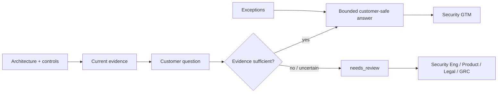

# SaaSSecOps

**AWS SaaS Security & Trust Reference Architecture**

SaaSSecOps is an open-source reference architecture and local assurance toolkit for multi-tenant SaaS security on AWS. It connects tenant isolation, application/API security, software supply-chain evidence, cloud controls and customer-trust workflows in one inspectable project.

> [!IMPORTANT]
> This repository is a **reference architecture and portfolio demonstration**. It does not prove that any AWS environment or SaaS application has been deployed, independently assessed, penetration tested, certified or approved for production.

Current package milestone: **v0.6.0 — Customer Trust & Security GTM**.

## Summary

v0.6 extends the security-control reference into customer trust. Security questionnaire answers, architecture assurance statements and exceptions are represented as machine-readable contracts. Affirmative answers require evidence, stronger claims require stronger assurance, and unresolved questions remain `needs_review`.

## Security assurance flow



## Included

- AWS multi-account security/logging reference with delegated administration.
- Pool, silo and bridge tenant-isolation contracts and negative cross-tenant tests.
- OWASP Top 10:2025 and OWASP API Security Top 10:2023 risk mappings.
- CodeQL, dependency audit and CycloneDX 1.7 SBOM gates.
- Vulnerability finding and time-bounded exception evidence.
- Evidence-bound security-questionnaire response contract.
- Customer trust reference contract and architecture assurance pack.
- Pen-test/audit/security-review exception register.
- Security Engineering / Product / Legal / GRC / Security GTM responsibility matrix.
- Fail-closed rules for unsupported `yes`, certification and independent-assessment claims.
- Deterministic assessment/evidence identity and validated Terraform references.

## Quickstart

```bash
python -m pip install -e .
```

Validate the trust contracts:

```bash
saassecops validate architecture/customer-trust-reference.json --kind customer-trust
saassecops validate examples/security-questionnaire.json --kind questionnaire
saassecops validate examples/trust-exceptions.json --kind trust-exceptions
```

Run the fail-closed customer trust reference:

```bash
python scripts/build_customer_trust_summary.py --output artifacts/customer-trust-summary.json
```

The synthetic questionnaire deliberately contains deployment-specific and certification questions that cannot be proven by this repository, so they remain `needs_review`.

## Customer trust model

Evidence strength is separated into `documented`, `configured`, `tested`, `independently_assessed` and `certified`. A repository design can support a documented reference statement; it cannot by itself justify production, independent-assessment or certification claims.

See [Customer Trust Playbook](docs/CUSTOMER_TRUST_PLAYBOOK.md), [Security Assurance Pack](docs/SECURITY_ASSURANCE_PACK.md), and [Security GTM Responsibility Matrix](docs/SECURITY_GTM_RESPONSIBILITY_MATRIX.md).

## Release direction

The path to v1.0 is evidence-gated rather than date-gated. Release criteria are maintained in [ROADMAP.md](ROADMAP.md), with compatibility expectations in [COMPATIBILITY.md](COMPATIBILITY.md).

## Explicit non-claims

SaaSSecOps does **not** establish deployed security effectiveness, vulnerability absence, penetration-test success, certification, regulatory compliance, contractual acceptance or customer approval. Synthetic tests and generated evidence demonstrate repository invariants only.

## Author

Bilge Kayalı

## License

Apache License 2.0.
