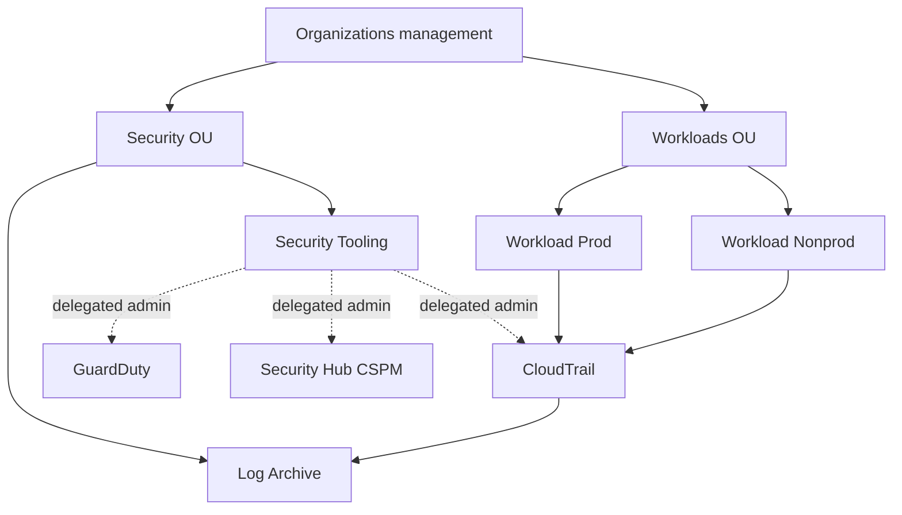
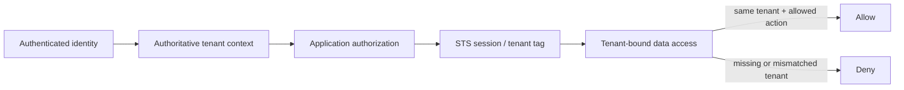
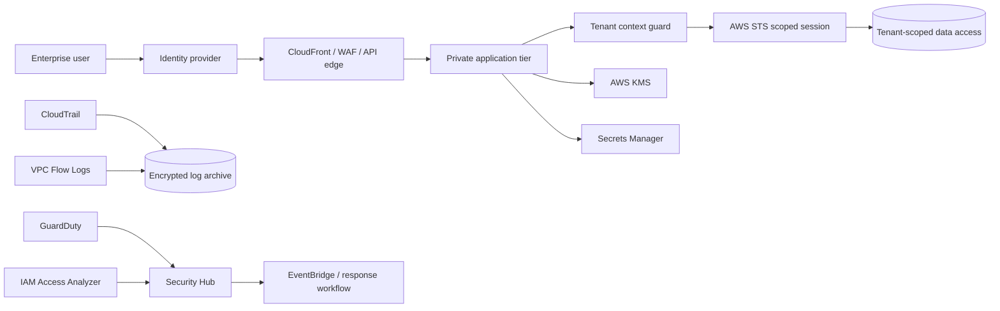

# SaaSSecOps

**AWS SaaS Security & Trust Reference Architecture**

SaaSSecOps is an open-source reference architecture and local assurance toolkit for reasoning about security in a multi-tenant SaaS environment on AWS. It connects tenant isolation, identity, network boundaries, encryption, audit logging, threat detection, security posture management and customer-trust evidence in one inspectable project.

> [!IMPORTANT]
> This repository is a **reference architecture and portfolio demonstration**. It does not prove that any AWS environment has been deployed, independently assessed, penetration tested, certified or approved for production. The included Terraform, organization guardrails and tenant-isolation patterns are reference baselines and must be reviewed, adapted and tested before any real deployment.

Current package milestone: **v0.4.0 — Tenant Isolation Patterns**.

## Summary

Security assurance for SaaS customers is rarely just one control. A credible security story has to connect architecture, tenant isolation, IAM, network boundaries, encryption, telemetry, detection, incident response and evidence that can be explained to technical and non-technical stakeholders.

SaaSSecOps models that connection through machine-readable contracts, deterministic evidence, a separated multi-account security model and explicit tenant-isolation patterns with negative tests.

## Multi-account security model



The management account is reserved for organization-level administration. Security operations are delegated to `security-tooling`, while centralized audit-log custody is separated into `log-archive`. See [Multi-Account Security Baseline](docs/MULTI_ACCOUNT_BASELINE.md).

## Tenant isolation model



v0.4 represents **pool, silo and bridge** SaaS patterns. For pooled authorization, the reference uses `tenant-id` as a synthetic STS session tag and `aws:PrincipalTag/tenant-id` as the example AWS policy attribute. Cross-tenant, missing-context and unauthorized-action vectors must fail closed in CI. See [Tenant Isolation](docs/TENANT_ISOLATION.md).

## Workload reference architecture



## Included

- Pool, silo and bridge tenant-isolation contracts.
- Authoritative tenant-context and fail-closed propagation rules.
- Synthetic cross-tenant denial tests and a deterministic internal isolation decision reference.
- AWS STS/ABAC pooled S3 example using `aws:PrincipalTag/tenant-id`.
- AWS IAM posture: federation, least privilege, short-lived credentials and IAM Access Analyzer.
- VPC/private-tier posture and VPC Flow Logs.
- KMS/data-protection posture including TLS, encryption at rest and managed secrets.
- CloudTrail multi-Region logging and log-file validation.
- GuardDuty and Security Hub detective controls.
- Account-scoped Terraform reference for CloudTrail, KMS, S3 log archive, GuardDuty, Security Hub and Access Analyzer.
- Multi-account reference contract covering management, Security OU, Workloads OU, Security Tooling and Log Archive boundaries.
- Illustrative AWS Organizations SCPs with explicit opt-in Terraform attachment.
- Delegated-administration guidance for CloudTrail, GuardDuty and Security Hub CSPM.
- Strict JSON Schema contracts for posture, policy, assessment report, evidence manifest, multi-account topology and tenant isolation.
- Deterministic assessment identity plus SHA-256 bindings for posture, policy and exact report bytes.
- CLI commands for validation, assessment, file digests and contract snapshots.
- Threat models, control matrix, customer-trust playbook and versioned v1 roadmap.

## Quickstart

Install locally:

```bash
python -m pip install -e .
```

Validate the public reference contracts:

```bash
saassecops validate examples/reference-architecture.json --kind posture
saassecops validate policies/aws-saas-controls.json --kind policy
saassecops validate architecture/multi-account-reference.json --kind multi-account
saassecops validate architecture/tenant-isolation-reference.json --kind tenant-isolation
```

Run tenant-isolation vectors:

```bash
python scripts/run_isolation_vectors.py
```

Generate a report and exact-byte evidence manifest:

```bash
saassecops assess examples/reference-architecture.json --policy policies/aws-saas-controls.json --output artifacts/reference-assessment.json --manifest-output artifacts/reference-manifest.json
```

The risky architecture example intentionally exits with code `2` because declared gaps are present:

```bash
saassecops assess examples/risky-architecture.json --policy policies/aws-saas-controls.json
```

Inspect the current public contract:

```bash
saassecops contract-snapshot
```

Run tests:

```bash
python -m unittest discover -s tests -v
```

## Control families

| Family | Purpose |
| --- | --- |
| TENANT | Prevent cross-tenant access and preserve tenant context |
| IAM | Least privilege, federation and permission analysis |
| NET | Private workload and network telemetry controls |
| DATA | Encryption, TLS, secrets and key separation |
| LOG | Durable and integrity-aware audit telemetry |
| DET | Threat detection and security posture visibility |
| IR | Response ownership, escalation and tested playbooks |
| TRUST | Architecture and assurance evidence suitable for customer conversations |

## Release direction

The path to v1.0 is evidence-gated rather than date-gated. The staged milestones and release criteria are maintained in [ROADMAP.md](ROADMAP.md), with compatibility expectations in [COMPATIBILITY.md](COMPATIBILITY.md).

## AWS guidance posture

The design is informed by the AWS Well-Architected SaaS Lens and AWS security architecture guidance.

- AWS SaaS Lens: https://docs.aws.amazon.com/wellarchitected/latest/saas-lens/saas-lens.html
- Tenant isolation: https://docs.aws.amazon.com/wellarchitected/latest/saas-lens/tenant-isolation.html
- Silo, Pool, and Bridge Models: https://docs.aws.amazon.com/wellarchitected/latest/saas-lens/silo-pool-and-bridge-models.html
- AWS STS session tags: https://docs.aws.amazon.com/IAM/latest/UserGuide/id_session-tags.html
- AWS IAM ABAC: https://docs.aws.amazon.com/IAM/latest/UserGuide/introduction_attribute-based-access-control.html
- AWS Organizations OU best practices: https://docs.aws.amazon.com/organizations/latest/userguide/orgs_manage_ous_best_practices.html
- AWS Security Reference Architecture: https://docs.aws.amazon.com/prescriptive-guidance/latest/security-reference-architecture/welcome.html

A passing local assessment does not establish AWS Well-Architected conformance, SOC 2 compliance, ISO 27001 certification, regulatory compliance, production security or customer acceptance.

## Explicit non-claims

SaaSSecOps does **not** by itself establish effective deployed tenant isolation, correct AWS IAM evaluation, correct AWS configuration, vulnerability absence, penetration-test success, production monitoring effectiveness, key-custody effectiveness, regulatory compliance or customer acceptance. Synthetic isolation vectors demonstrate repository invariants only. The Terraform and IAM reference examples have not been applied to a production AWS environment by this repository.

## Author

Bilge Kayalı

## License

Apache License 2.0.
